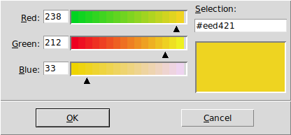
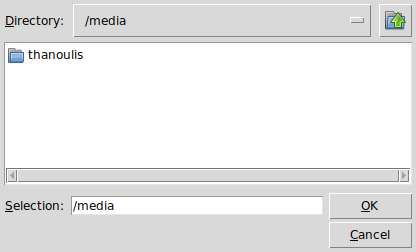
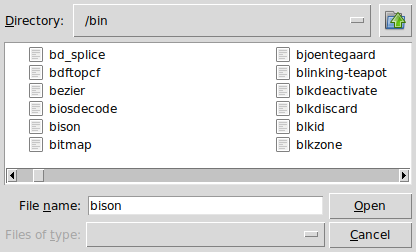
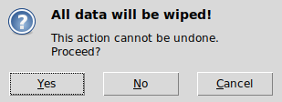
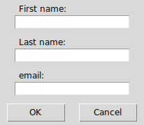
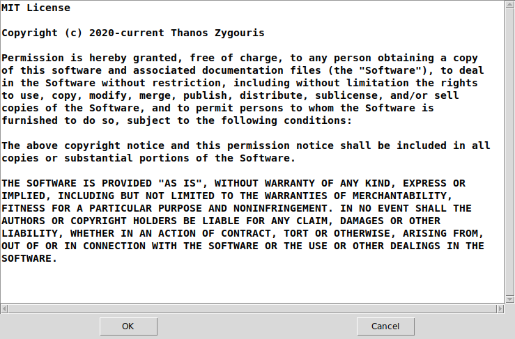
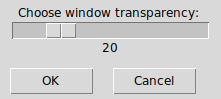
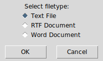
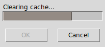

**tpmg** is a 'Poor Mans's GUI' much like [zenity](https://gitlab.gnome.org/GNOME/zenity) or [kdialog](https://invent.kde.org/utilities/kdialog) written in core [Tcl/Tk](https://www.tcl.tk).

### Dialogs
* [Color](#color-dialog "Color")
* [Directory](#directory-dialog "Directory")
* [FileSelect](#fileselect-dialog "FileSelect")
* [FileSave](#filesave-dialog "FileSave")
* [Information](#information-dialog "Information")
* [Password](#password-dialog "Password")
* [Entry](#entry-dialog "Entry")
* [Scale](#scale-dialog "Scale")
* [List](#list-dialog "List")
* [Progress](#progress-dialog "Progress")

#### Color dialog
* options:
  | option   | type     | description       | default           |
  |:--------:|:--------:|:-----------------:|:-----------------:|
  | --title= | string   | set window title  | "Select a Color"  |
  | --color= | hexcolor | set initial color | "#d9d9d9"         |
  | --help   |          | this help         |
* returns:
  | OK      | Cancel | Error |
  |:-------:|:------:|:-----:|
  | *color* | 1      | 255   |
* example:  
  `tpmg --color --title="Choose Color" --color="#eed421"`
* screenshot:  


#### Directory dialog
* options:
  | option   | type   | description          | default              |
  |:--------:|:------:|:--------------------:|:--------------------:|
  | --title= | string | set window title     | "Select a Directory" |
  | --exist  |        | directory must exist |
  | --help   |        | this help            |
* returns:
  | OK               | Cancel | Error |
  |:----------------:|:------:|:-----:|
  | *directory path* | 1      | 255   |
* example:  
`tpmg --directory --title="Select a Directory" --exist`
* screenshot:  


#### FileSelect dialog
* options:
  | option    | type   | description           | default        |
  |:---------:|:------:|:---------------------:|:--------------:|
  | --title=  | string | set window title      | "Select Files" |
  | --single  |        | single file selection |
  | --help    |        | this help             |
* returns:
  | OK           | Cancel | Error |
  |:------------:|:------:|:-----:|
  | *files path* | 1      | 255   |
* example:  
`tpmg --fileselect --title="Select a File" --single`
* screenshot:  


#### FileSave dialog
* options:
  | option       | type   | description                 | default       |
  |:------------:|:------:|:---------------------------:|:-------------:|
  | --title=     | string | set window title            | "Save File"   |
  | --file=      | path   | set initial file            |
  | --noconfirm  |        | do not confirm on overwrite |
  | --help       |        | this help                   |
* returns:
  | OK          | Cancel | Error |
  |:-----------:|:------:|:-----:|
  | *file path* | 1      | 255   |
* example:  
`tpmg --filesave --title="Save File" --file="~/myfile.txt" --noconfirm`
* screenshot:  


#### Information dialog
* options:
  | option          | type               | description                 | default |
  |:---------------:|:------------------:|:---------------------------:|:-------:|
  | --title=        | string             | set window title            |
  | --icon=         | icon<sup>1</sup>   | icon to use in dialog       | info    |
  | --button=       | button<sup>2</sup> | buttons to use in dialog    | ok      |
  | *first string*  | string             | main message (in bold)      |
  | *other string*  | string             | message details             |  
  | --help          |                    | this help                   |
>1: info error question warning  
>2: ok okcancel yesno yesnocancel retrycancel abortretryignore
* returns:  
  the button<sup>2</sup> name
* example:  
`tpmg --information --title="Are you sure?" --icon="question" --button="yesnocancel" "All data will be wiped!" "This action cannot be undone." "Proceed?"`
* screenshot:  


#### Password dialog
* options:
  | option        | type   | description                 | default      |
  |:-------------:|:------:|:---------------------------:|:------------:|
  | --title=      | string | set window title            | "Login As"   |
  | --nousername  |        | hide the "Username" entry   |
  | --help        |        | this help                   |
* returns:
  | OK                    | Cancel | Error |
  |:---------------------:|:------:|:-----:|
  | *username* *password* | 1      | 255   |
* example:  
`tpmg --password --title="Welcome $USER" --nousername`
* screenshot:  


#### Entry dialog
* options:
  | option        | type   | description      | default             |
  |:-------------:|:------:|:----------------:|:-------------------:|
  | --title=      | string | set window title | "Enter Text"        |
  | --text=       | string | set label text   | "Enter text below:" |
  | --help        |        | this help        |
* returns:
  | OK      | Cancel | Error |
  |:-------:|:------:|:-----:|
  | *entry* | 1      | 255   |
* example:  
`tpmg --entry --title="Search terms" --text="Search for:"`
* screenshot:  


#### Text dialog
* options:
  | option          | type   | description       | default       |
  |:---------------:|:------:|:-----------------:|:-------------:|
  | --title=        | string | set window title  | "Show Text"   |
  | --file=         | path   | text file to show |
  | --edit          |        | can edit text     | cannot edit   |
  | --font=         | font   | font to use       | "TkFixedFont" |
  | *other strings* | string | text body (every string is a new line) |  
  | --help          |        | this help         |
>In case of multiple inputs, **Text** will concatenate the result, with hierarchy: file string stdin
* returns:  
  | OK | Cancel | Error |
  |:--:|:------:|:-----:|
  | ok | 1      | 255   |
* example:  
`tpmg --text --title="README" --file="~/README.txt" --edit --font="{DejaVu Sans Mono} 12 bold"`
* screenshot:  


#### Scale dialog
* options:
  | option   | type    | description       | default               |
  |:--------:|:-------:|:-----------------:|:---------------------:|
  | --title= | string  | set window title  | "Adjust Value"        |
  | --text=  | string  | set label text    | "Adjust value below:" |
  | --min=   | integer | set min value     | 0                     |
  | --max=   | integer | set max value     | 100                   |
  | --value= | integer | set initial value | 0                     |
  | --help   |         | this help         |
* returns:  
  | OK      | Cancel | Error |
  |:-------:|:------:|:-----:|
  | *scale* | 1      | 255   |
* example:  
`tpmg --scale --title="Adjust Transparency" --text="Choose window transparency:" --min="0" --max="100" --value="20"`
* screenshot:  


#### List dialog
* options:
  | option     | type         | description       | default              |
  |:----------:|:------------:|:-----------------:|:--------------------:|
  | --title=   | string       | set window title  | "Set Options"        |
  | --text=    | string       | set label text    | "Set options below:" |
  | --type=    | check\|radio | set list type     | check                |
  | --options= | csv          | set options list  |
  | --default= | radio: string<br/>check: csv | radio: default option<br/>check: set option to true |
  | --anchor=  | w\|e\|c      | list placement in window | w             |
  | --help     |              | this help         |
* returns:  
  | OK                      | Cancel | Error |
  |:-----------------------:|:------:|:-----:|
  | radio: selected option  | 1      | 255   |
  | check: true\|false list | 1      | 255   |
* example:  
`tpmg --list --title="Select filetype" --text="Select filetype:" --type="radio" --options="Text File,RTF Document,Word Document" --default="Text File" --anchor="w"`
* screenshot:  


#### Progress dialog
* description:  
**Progress** dialog reads data from **stdin** line by line.
Lines must be prefixed with `tpmg:`. All other lines are ignored.
If the rest are only numbers, the progress bar advances to that number.
Else, it updates the label text.
* options:
  | option   | type     | description                | default         |
  |:--------:|:--------:|:--------------------------:|:---------------:|
  | --title= | string   | set window title           | "Show Progress" |
  | --text=  | string   | set label text             |
  | --color= | hexcolor | set progress bar color     | Tk default      |
  | --pulse  |          | pulsating progress bar     |
  | --auto   |          | close window on completion |
  | --max=   | integer  | set max value              | 100             |
  | --value= | integer  | set initial bar value      | 0               |
  | --help   |          | this help                  |
* returns:  
  | OK | Cancel | Error |
  |:--:|:------:|:-----:|
  | ok | 1      | 255   |
* example:  
```
#!/usr/bin/env sh
(
echo "tpmg:Starting jobs..."; sleep 1
echo "tpmg:30"; echo "tpmg:Setting variables..."; sleep 1
echo "tpmg:70"; echo "tpmg:Clearing cache..."; sleep 1
echo "This line will be ignored"; sleep 1
echo "tpmg:100"; echo "tpmg:Done."
) | tpmg --progress --color="#948b84" --auto
```
* screenshot:  

* bugs: wrong behavior on pulsating progress bar (not critical though)

### Dependencies
* **Tcl** version 8.6 or later.
* **Tk** version 8.6 or later.

##### For Microsoft Windows users:
* [ActiveTcl](https://www.activestate.com/activetcl) version 8.6 or later.


### License
**tpmg** is licensed under the **MIT License**.

Read LICENSE for details.
