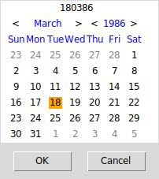
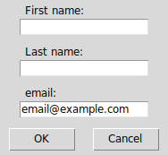
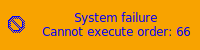
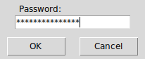
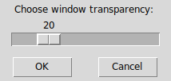

----

**tpmg** is a **Poor Man's GUI** much like [zenity](https://gitlab.gnome.org/GNOME/zenity) or [kdialog](https://invent.kde.org/utilities/kdialog) written in core [Tcl/Tk](https://www.tcl.tk).

----

### Dialogs

* [Calendar](#calendar-dialog "Calendar")
* [Color](#color-dialog "Color")
* [Directory](#directory-dialog "Directory")
* [Entry](#entry-dialog "Entry")
* [FileSave](#filesave-dialog "FileSave")
* [FileSelect](#fileselect-dialog "FileSelect")
* [Information](#information-dialog "Information")
* [List](#list-dialog "List")
* [Notification](#notification-popup "Notification")
* [Password](#password-dialog "Password")
* [Progress](#progress-dialog "Progress")
* [Scale](#scale-dialog "Scale")
* [Text](#text-dialog "Text")

----

#### Calendar dialog

* description:

  Display a date selection dialog.

  Date format can be customized with `--format` option.

  Format options are almost the same with `date` utility from **coreutils**.

  See `man n clock` or `man 1 date` for details.

* options:
  | option        | type    | description       | default       |
  |---------------|:-------:|-------------------|:-------------:|
  | --title=      | string  | set window title  | "Select Date  |
  | --format=     | string  | format date       | "%a %d %b %Y" |
  | --day=        | integer | set initial day   | current day   |
  | --month=      | integer | set initial month | current month |
  | --year=       | integer | set initial year  | current year  |
  | --help        |         | this help         |

* returns:

  | OK                | Cancel | Error |
  |:-----------------:|:------:|:-----:|
  | selected<br/>date | 1      | 255   |

* example:

  ```shell
  tpmg --calendar --title="Select a date" --format="%d%m%y" \
    --day="18" --month="3" --year="1986"
  ```

* screenshot:

  

----

#### Color dialog

* description:

  Displays a color selection dialog. Appearance depends on platform.

* options:

  | option   | type     | description       | default           |
  |----------|:--------:|-------------------|:-----------------:|
  | --title= | string   | set window title  | "Select a Color"  |
  | --color= | hexcolor | set initial color | "#d9d9d9"         |
  | --help   |          | this help         |

* returns:

  | OK    | Cancel | Error |
  |:-----:|:------:|:-----:|
  | color | 1      | 255   |

* example:

  ```shell
  tpmg --color --title="Choose Color" --color="#eed421"
  ```

* screenshot:

  

----

#### Directory dialog

* description:

  Display a directory select dialog. Appearance depends on platform.

* options:

  | option   | type   | description          | default              |
  |----------|:------:|----------------------|:--------------------:|
  | --title= | string | set window title     | "Select a Directory" |
  | --exist  |        | directory must exist |
  | --help   |        | this help            |

* returns:

  | OK        | Cancel | Error |
  |:---------:|:------:|:-----:|
  | directory | 1      | 255   |

* example:

  ```shell
  tpmg --directory --title="Select a Directory" --exist
  ```

* screenshot:

  

----

#### Entry dialog

* description:

  Display any number of entry dialogs. Default is one.

  Configuration is done through `--text` option, with comma separated label texts, as in example below.

* options:
  | option        | type   | description      | default             |
  |---------------|:------:|------------------|:-------------------:|
  | --title=      | string | set window title | "Enter Text"        |
  | --text=       | csv    | set label text   | "Enter text below:" |
  | --default=    | csv    | set initial text |
  | --help        |        | this help        |

* returns:

  | OK         | Cancel | Error |
  |:----------:|:------:|:-----:|
  | entry list | 1      | 255   |

* example:

  ```shell
  tpmg --entry --title="Personal Information" \
    --text="First name:,Last name:,email:" \
    --default=",,email@example.com"
  ```

* screenshot:

  

----

#### FileSave dialog

* description:

  Display a file save dialog. Appearance depends on platform.

* options:

  | option       | type   | description                 | default           |
  |--------------|:------:|-----------------------------|:-----------------:|
  | --title=     | string | set window title            | "Save File"       |
  | --ext=       | csv    | set filetype filter         | show all files    |
  | --file=      | path   | set initial file            |
  | --noconfirm  |        | do not confirm on overwrite | confirm overwrite |
  | --help       |        | this help                   |

* returns:

  | OK        | Cancel | Error |
  |:---------:|:------:|:-----:|
  | file path | 1      | 255   |

* example:

  ```shell
  tpmg --filesave --title="Save File" --file="~/myfile.txt" --noconfirm
  ```

* screenshot:

  

----

#### FileSelect dialog

* description:

  Display a file selection dialog. Appearance depends on platform.

* options:

  | option    | type   | description           | default        |
  |-----------|:------:|-----------------------|:--------------:|
  | --title=  | string | set window title      | "Select Files" |
  | --ext=    | csv    | set filetype filter   | show all files |
  | --single  |        | single file selection |
  | --help    |        | this help             |

* returns:

  | OK        | Cancel | Error |
  |:---------:|:------:|:-----:|
  | file list | 1      | 255   |

* example:

  ```shell
  tpmg --fileselect --title="Select a File" --ext="*.txt,*" --single
  ```

* screenshot:

  

----

#### Information dialog

* description:

  Display an information dialog. Supports icons for info, error, question and warning.

  Can have a combination of buttons, as okcancel, yesno, retrycancel, etc.

  Main message is bold and equals to the first non option string.

  All other strings are message details, with every string represent a line.

* options:

  | option       | type               | description                 | default |
  |--------------|:------------------:|-----------------------------|:-------:|
  | --title=     | string             | set window title            |
  | --icon=      | icon<sup>1</sup>   | icon to use in dialog       | info    |
  | --button=    | button<sup>2</sup> | buttons to use in dialog    | ok      |
  | first string | string             | main message (in bold)      |
  | other string | string             | message details             |
  | --help       |                    | this help                   |

  >1: info error question warning<br/>
  >2: ok okcancel yesno yesnocancel retrycancel abortretryignore

* returns:

  the button<sup>2</sup> name

* example:

  ```shell
  tpmg --information --title="Are you sure?" --icon="question" \
    --button="yesnocancel" "All data will be wiped!" \
    "This action cannot be undone." "Proceed?"
  ```

* screenshot:

  

----

#### List dialog

* description:

  Display an option list with radio, combobox, check buttons or menu items. Default type is check buttons.

  Configuration is done through `--options` option, with comma separated list, much like in **Entry** dialog.

  Can also set the "default" option in a radio/combobox/menu list, or toggle default values in the check list.

  The following example shows how.

* options:

  | option     | type         | description       | default              |
  |------------|:------------:|-------------------|:--------------------:|
  | --title=   | string       | set window title  | "Set Options"        |
  | --text=    | string       | set label text    | "Set options below:" |
  | --type=    | radio\|combo\|menu\|check | set list type | check |
  | --options= | csv          | set options list  |
  | --default= | radio:string<br/>combo:string<br/>menu:string<br/>check:csv | radio:default option<br/>combo:default option<br/>menu:default menu<br/>check:set option to true |
  | --anchor=  | w\|e\|c      | list placement in window | w             |
  | --edit     |              | can edit combobox | read only            |
  | --help     |              | this help         |

* returns:

  | OK                      | Cancel | Error |
  |:-----------------------:|:------:|:-----:|
  | radio: selected option  | 1      | 255   |
  | combo: selected option  | 1      | 255   |
  | menu : clicked item     | 1      | 255   |
  | check: true\|false list | 1      | 255   |

* example:

  ```shell
  tpmg --list --title="Select filetype" --text="Select filetype:" \
    --type="radio" --options="Text File,RTF Document,Word Document" \
    --default="Text File" --anchor="w"
  ```

* screenshot:

  

----

#### Notification popup

* description:

  Display a notification popup.

  Does not need a running notification daemon.

  Notification popup will close when clicked, or after `delay` seconds.

* options:
  | option        | type                 | description                     | default             |
  |---------------|:--------------------:|---------------------------------|:-------------------:|
  | --title=      | string               | set window title                | "tPMG Notification" |
  | --delay=      | integer              | set timeout (seconds)           | 5                   |
  | --geometry=   | `width`x`height±X±Y` | set popup geometry <sup>1</sup> | upper right corner  |
  | --icon=       | icon<sup>2</sup>     | icon to use                     |
  | --background= | hexcolor             | set background color            | orange              |
  | --foreground= | hexcolor             | set foreground color            | black               |
  | other strings | string               | text to show                    |
  | --help        |                      | this help                       |

  >1:<br/>
  > width:  popup width in pixels<br/>
  > height: popup height in pixels<br/>
  > X:      popup X position on screen<br/>
  > Y:      popup Y position on screen<br/>
  >`width`x`height` or `±X±Y` can be omitted<br/>
  >2: info error question warning

* returns:

  | OK   | Error |
  |:----:|:-----:|
  | ok   | 255   |

* example:

  ```shell
  tpmg --notification --title="Notify Sith Lord" --delay="10" \
    --geometry="200x50+0+0" --icon="error" \
    --background="#f8a300" --foreground="#000000" \
    "System failure" "Cannot execute order 66"
  ```

* screenshot:

  

----

#### Password dialog

* description:

  Display a classic username/password dialog.

  Username entry can be omitted.

  Password entry hides text with asterisks.

* options:

  | option        | type   | description                 | default      |
  |---------------|:------:|-----------------------------|:------------:|
  | --title=      | string | set window title            | "Login As"   |
  | --nousername  |        | hide the "Username" entry   |
  | --help        |        | this help                   |

* returns:

  | OK                    | Cancel | Error |
  |:---------------------:|:------:|:-----:|
  | username<br/>password | 1      | 255   |

* example:

  ```shell
  tpmg --password --title="Welcome $USER" --nousername
  ```

* screenshot:

  

----

#### Progress dialog

* description:

  Display a progress bar dialog.

  **Progress** dialog reads data from `stdin` line by line.

  Lines must be prefixed with `tpmg:`, or are ignored.

  If text is a number, the progress bar advances to that number.

  Else, it updates the label text.

* options:

  | option   | type     | description                | default         |
  |----------|:--------:|----------------------------|:---------------:|
  | --title= | string   | set window title           | "Show Progress" |
  | --text=  | string   | set label text             |
  | --color= | hexcolor | set progress bar color     | Tk default      |
  | --pulse  |          | pulsating progress bar     |
  | --auto   |          | close window on completion |
  | --max=   | integer  | set max value              | 100             |
  | --value= | integer  | set initial bar value      | 0               |
  | --help   |          | this help                  |

* returns:

  | OK | Cancel | Error |
  |:--:|:------:|:-----:|
  | ok | 1      | 255   |

* example:

  ```shell
  #!/usr/bin/env sh
  (
  echo "tpmg:Starting jobs..."; sleep 1
  echo "tpmg:30"; echo "tpmg:Setting variables..."; sleep 1
  echo "tpmg:70"; echo "tpmg:Clearing cache..."; sleep 1
  echo "This line will be ignored"; sleep 1
  echo "tpmg:100"; echo "tpmg:Done."
  ) | tpmg --progress --color="#948b84" --auto
  ```

* screenshot:

  

* bugs:

  Wrong behavior on pulsating progress bar (not critical).

----

#### Scale dialog

* description:

  Display a scale dialog. Min, max and current value can be configured.

* options:

  | option   | type    | description       | default               |
  |----------|:-------:|-------------------|:---------------------:|
  | --title= | string  | set window title  | "Adjust Value"        |
  | --text=  | string  | set label text    | "Adjust value below:" |
  | --min=   | integer | set min value     | 0                     |
  | --max=   | integer | set max value     | 100                   |
  | --value= | integer | set initial value | 0                     |
  | --step=  | integer | set step size     | 1                     |
  | --help   |         | this help         |

* returns:

  | OK    | Cancel | Error |
  |:-----:|:------:|:-----:|
  | scale | 1      | 255   |

* example:

  ```shell
  tpmg --scale --title="Adjust Transparency" \
    --text="Choose window transparency:" \
    --min="0" --max="100" --value="20"
  ```

* screenshot:

  

----

#### Text dialog

* description:

  Display a text information dialog.

  Text can be from file, from command line in the form of every string is a new line and from standard input.

  In case of multiple inputs, will concatenate the text, with `file`->`string`->`stdin` hierarchy.

* options:

  | option        | type   | description       | default       |
  |---------------|:------:|-------------------|:-------------:|
  | --title=      | string | set window title  | "Show Text"   |
  | --file=       | path   | text file to show |
  | --edit        |        | can edit text     | cannot edit   |
  | --font=       | font   | font to use       | "TkFixedFont" |
  | other strings | string | text body (every string is a new line) |
  | --help        |        | this help         |

* returns:

  | OK | Cancel | Error |
  |:--:|:------:|:-----:|
  | ok | 1      | 255   |

* example:

  ```shell
  tpmg --text --title="README" --file="~/README.txt" \
    --edit --font="{DejaVu Sans Mono} 12 bold"
  ```

* screenshot:

  

----

### Dependencies

* **Tcl** version 8.6 or later.

* **Tk** version 8.6 or later.

##### For Microsoft Windows users:

* [ActiveTcl](https://www.activestate.com/activetcl) version 8.6 or later.

----

### License

**tpmg** is licensed under the **MIT License**.

Read [LICENSE](LICENSE) for details.

----
